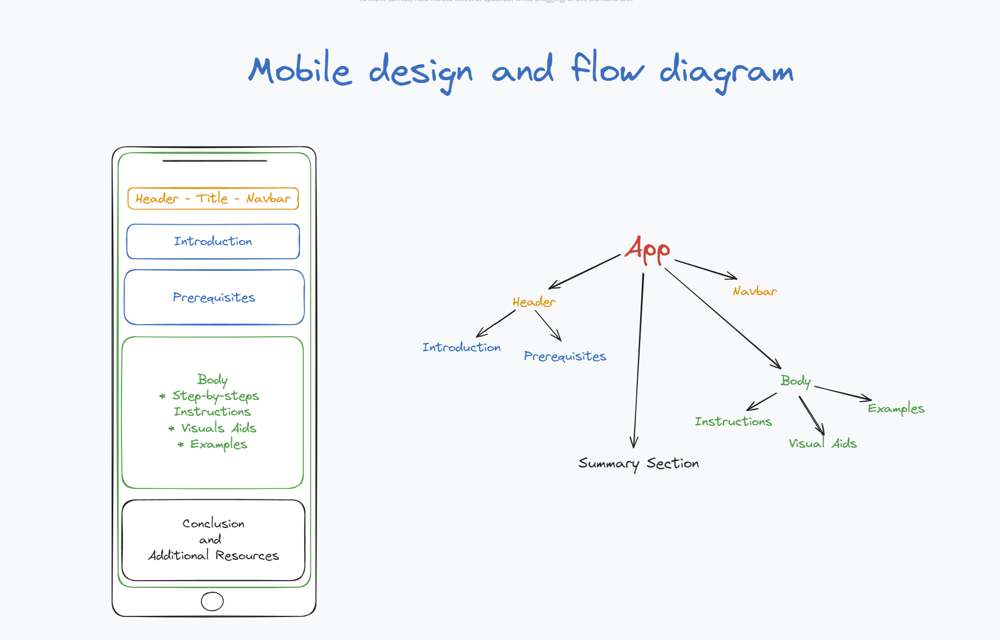

# TypeScript Tutorial - SoC Hackathon

This is a School of Code Challenge for bootcampers to create training materials to help colleagues learn TypeScript so that it's more easily adopted across the organisation.

---

## Table of Content

- [Planning](#Planning)
- [Resources_links](#Resources_links)
- [Feedback](#Feedback)
- [License](#License)

---

## Planning

### Master Plan for TypeScript Tutorial

#### 1. Define Acceptance Criteria

```
As a developer/bootcamper at School of Code,
I want to create comprehensive training materials for TypeScript,
so that it can be more easily adopted across the organization.
```

#### 2. Research Tutorial and Article Creation

- Look for tutorial/article body structures.

#### 3. Create a Flow Chart and Prototype

#### 4. Initialize MVP 1

- Create TypeScript tutorial:
  - **Setting up TypeScript in Your Local Environment**
    - Research detailed instructions for setting up TypeScript in the local environment, including code snippets.
  - **Setting up TypeScript File Structure for JavaScript Project**
  - **Learning Materials About TypeScript**
    - Gather TypeScript documentations, W3Schools resources, YouTube videos, etc.

#### 5. Move to MVP 2

- No details yet.

---

### Below is a draft of mobile design and flow chart to visualize how the project will look like.



---

## Deployed Website URL

- https://typescript-tutorial.netlify.app/

---

## Resources_links

Here are for resources used as guide in building the web application.

- https://www.typescriptlang.org/tools
- https://www.w3schools.com/typescript/index.php
- https://www.youtube.com/watch?v=HvxYkugp55A&t=6s
- https://www.typescriptlang.org/tsconfig
- https://www.typescriptlang.org/docs/
- https://www.typescriptlang.org/play

---

## Feedback

Click this [form](https://feedback-form-mcc.netlify.app/) for feedback and questions.

---

## License

[](https://opensource.org/licenses/MIT) .
